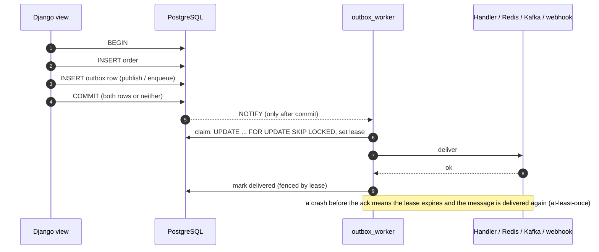

# django-reliable-outbox

[](https://github.com/CtrlAltDevelop/django-reliable-outbox/actions/workflows/ci.yml)


A transactional outbox and reliable background jobs for Django on PostgreSQL.
Publish an event or enqueue a job **in the same transaction** as the data it's
about. If the transaction commits, the work will happen, even if the process
dies on the next line. If it rolls back, the work never existed. There is no
broker to run for the simple case, and retries, backoff, dead-lettering and
per-key ordering come with it.

```python
from django.db import transaction
from reliable_outbox import publish, job

@job(retries=5, backoff="exponential")
def send_receipt(order_id: int) -> None: ...

with transaction.atomic():
    order.save()
    publish("order.created", {"id": order.id}, key=f"order-{order.id}")
    send_receipt.enqueue(order.id)   # runs only if this transaction commits
```

## The problem: dual writes

Saving to the database and then telling another system about it is two writes
to two systems, and no transaction spans both:

```python
order.save()                                   # 1. commits
broker.send("order.created", order.id)         # 2. the process dies first: event lost
```

Swap the lines and it fails the other way: the event goes out, the save fails,
and consumers act on an order that doesn't exist. `transaction.on_commit`
narrows the window but doesn't close it: a crash after the commit and before
the callback still loses the event.

The outbox pattern turns two writes into one. The event is a row in the same
database, written in the same transaction; a separate worker delivers it
afterwards and retries until it succeeds.



## Quickstart

```bash
pip install "django-reliable-outbox[psycopg]"
```

```python
# settings.py
INSTALLED_APPS = [..., "reliable_outbox"]
```

```bash
python manage.py migrate
python manage.py outbox_worker     # run it like any other process: systemd, k8s, supervisor
```

Define handlers in an `outbox_handlers.py` (and jobs in a `jobs.py`) inside any
installed app; both are auto-discovered:

```python
# shop/outbox_handlers.py
from reliable_outbox import Envelope, handler

@handler("order.created")                 # exact name, or a pattern like "order.*"
def update_search_index(envelope: Envelope) -> None:
    reindex(envelope.payload["id"])
```

[`example/`](example/) is a runnable project with a model, a service function,
a job and an idempotent handler.

## Guarantees

What is promised, and what isn't. Every promise marked *Yes* is exercised by
a test against a real PostgreSQL server (see [`tests/`](tests/)): rollback,
crash and lease expiry with a killed worker process, ten workers on ten
thousand messages, per-key order under concurrent workers and retries,
backoff, dead-lettering and requeue, webhook signatures, inbox dedup.

| | Guaranteed? | Details |
|---|---|---|
| **Delivery** | **At least once. Not exactly once.** | A committed message is delivered until it succeeds or runs out of attempts. It can be delivered **more than once**: if a worker dies after the destination accepted the message but before the acknowledgement commits, or its lease expires mid-run, the message goes out again. Consumers must be idempotent; see the [inbox](#inbox-deduplicating-on-the-consumer-side). |
| Rolled-back transaction publishes nothing | Yes | The row is part of your transaction. Savepoints too: a rolled-back `atomic()` block drops only its own messages. |
| Nothing lost once committed | Yes | The row is durable when `COMMIT` returns. A crashed worker's messages come back when its lease expires. |
| DB writes of local handlers and jobs happen once | Yes | Handlers and jobs run in the same transaction as the fenced acknowledgement. A failed or superseded run rolls back its writes. Covers the outbox's own database only. |
| External side effects happen once | **No** | An email sent or an HTTP call made before a crash is made again. Use idempotency keys (`envelope.message_id`) or the inbox. |
| Two workers never run one message at the same time | While the lease is valid | `SKIP LOCKED` and leases prevent it. If a handler outlives `LEASE_SECONDS`, another worker may start it; the slower run's DB writes are then rolled back by the fence, but its external effects are not. Set the lease longer than your slowest handler. |
| Per-key order | Yes, for messages sharing a `key` | One at a time, in insertion (`id`) order, across all workers, through retries. Different keys and unkeyed messages run in parallel. Concurrent transactions publishing the same key are ordered by id, not by commit; serialise them with a row lock on the aggregate if that matters ([ADR 0003](docs/adr/0003-per-key-ordering.md)). |
| A failed message doesn't block its key forever | Configurable | Retries always hold the key. A dead-lettered head holds it until requeued with `BLOCK_KEY_ON_DEAD_LETTER=True` (default), or lets later messages pass with `False`. |
| Global order across keys | No | Roughly FIFO by id, not guaranteed. |
| `run_at` / `delay` | Never early; may be late | Never claimed before it's due; picked up within one poll interval after. Measured by the database clock, not the app server's. |
| Latency | Best effort | NOTIFY wakes idle workers on commit. A lost notification falls back to polling. |
| Throughput | Bounded by commits | One commit per acknowledged message; see [benchmarks](#benchmarks). |

## Using it

### Events

```python
publish(
    "order.created",            # event type, routed to a destination
    {"id": 42},                 # JSON (Django's encoder: dates, UUIDs, Decimals become strings)
    key="order-42",             # optional ordering key
    delay=timedelta(minutes=5), # or run_at=aware_datetime
    headers={"trace_id": "..."},
    max_attempts=20,            # default: RELIABLE_OUTBOX["MAX_ATTEMPTS"]
)                               # returns the message_id (UUID)
```

`publish` outside `transaction.atomic()` still works: in autocommit mode the
insert is its own transaction and commits immediately, like any other write.
Set `REQUIRE_TRANSACTION = True` to make that an error, which catches the "I
thought this was in the transaction" bug.

### Jobs

```python
@job(retries=5, backoff="exponential", name="billing.charge")
def charge(invoice_id: int, *, amount_cents: int) -> None: ...

charge.enqueue(7, amount_cents=1250)
charge.enqueue_with(args=[7], kwargs={"amount_cents": 1250}, key="customer-3", delay=timedelta(hours=1))
charge(7, amount_cents=1250)          # still callable inline
```

`retries=5` means up to six runs. Name jobs explicitly if you might move the
function while messages for it are queued; the default name is `module.qualname`.

### Failures

Any exception is a failed attempt, retried after
`uniform(0, min(BACKOFF_MAX_SECONDS, BACKOFF_BASE_SECONDS * 2 ** (attempt - 1)))`
seconds ([full jitter](https://aws.amazon.com/blogs/architecture/exponential-backoff-and-jitter/)),
or `BACKOFF_BASE_SECONDS` with `backoff="fixed"`. Raise
`reliable_outbox.PermanentError` for input that will never succeed, and the
message goes straight to the dead-letter state. Dead messages keep their last
error and traceback, and can be requeued with fresh attempts:

```bash
python manage.py outbox_requeue 1234 1235
python manage.py outbox_requeue --name billing.charge --dry-run
python manage.py outbox_requeue --all
```

or with the admin's *Requeue selected dead messages* action.

### Destinations

Events go to the `default` destination unless `ROUTES` says otherwise. Jobs
always run locally.

```python
RELIABLE_OUTBOX = {
    "DESTINATIONS": {
        "default": {"BACKEND": "reliable_outbox.destinations.local.LocalHandlers"},
        "stream": {
            "BACKEND": "reliable_outbox.destinations.redis.RedisStreamDestination",
            "OPTIONS": {"url": "redis://localhost:6379/0", "stream": "events:{name}", "maxlen": 100_000},
        },
        "kafka": {
            "BACKEND": "reliable_outbox.destinations.kafka.KafkaDestination",
            "OPTIONS": {"topic": "{name}", "config": {"bootstrap.servers": "kafka:9092"}},
        },
        "partner": {
            "BACKEND": "reliable_outbox.destinations.webhook.WebhookDestination",
            "OPTIONS": {"url": "https://partner.example.com/hooks", "secret": env("PARTNER_HOOK_SECRET")},
        },
    },
    "ROUTES": {"analytics.*": "stream", "order.*": "kafka", "partner.*": "partner"},
}
```

A destination is any class with `deliver(envelope) -> None` that returns once
the message is safely handed over and raises otherwise
(`reliable_outbox.destinations.Destination` is the protocol). Kafka and Redis
need the `kafka` / `redis` extras. Kafka delivery waits for the broker's ack
for each message and uses the message key as the record key, so per-key order
carries over into partition order.

**Webhooks** are signed with HMAC-SHA256 over `"{timestamp}.{body}"`, sent as
`X-Outbox-Signature: t=...,v1=...`. Receivers verify with:

```python
from reliable_outbox.destinations.webhook import verify_signature

if not verify_signature(request.body, request.headers["X-Outbox-Signature"], SECRET, tolerance=300):
    return HttpResponse(status=400)
```

A 2xx response acknowledges. 408, 425, 429, 5xx and network errors are
retried; any other 4xx is treated as permanent.

If a destination is down for an hour, nothing is lost: its messages fail,
back off (capped at `BACKOFF_MAX_SECONDS`), and pile up as pending rows. Make
sure `MAX_ATTEMPTS` and the backoff cap together outlast the outages you
expect, or the oldest messages will be dead-lettered and need a requeue.

### Inbox: deduplicating on the consumer side

At-least-once means consumers see duplicates. Record the `message_id` in the
same transaction as the work, and a duplicate becomes a no-op:

```python
from reliable_outbox import handler, inbox

@handler("order.created")
@inbox.idempotent("loyalty-points")
def award_points(envelope): ...

# or by hand, in any consumer (e.g. a webhook view):
with transaction.atomic():
    if inbox.claim(message_id, consumer="loyalty-points"):
        award_points_for(order_id)
```

`inbox.claim` refuses to run outside a transaction, where the record would
commit before the work it guards.

### Running workers

```bash
python manage.py outbox_worker --concurrency 4     # 4 threads, a connection each (+1 each for LISTEN)
python manage.py outbox_worker --burst             # drain what's due and exit (cron, tests)
python manage.py outbox_worker --no-notify --poll-interval 5
```

Run as many worker processes as you like, on as many machines; they
coordinate through row locks alone. On SIGTERM or SIGINT (SIGBREAK on Windows)
a worker finishes the message in hand, returns the unstarted rest of its batch
to the queue and exits. A second signal stops it immediately; the leases of
anything in flight then expire and those messages are retried.

### Operations

```bash
python manage.py outbox_stats [--json]      # ready, in flight, scheduled, retrying, dead, lag
python manage.py outbox_cleanup             # delete delivered rows older than RETENTION_HOURS
python manage.py outbox_cleanup --older-than 24 --dead --inbox
```

Delivered rows are kept for `RETENTION_HOURS` so recent traffic can be
inspected; run `outbox_cleanup` from cron. Deletes are batched to keep locks
and WAL bursts short. At very high volume, partition the table by
`created_at` and drop old partitions instead.

For metrics, connect to `reliable_outbox.signals.message_delivered`
(`envelope`, `duration`, `queued_for`), `message_failed` (`envelope`, `error`,
`retry_in`) and `message_dead_lettered` (`envelope`, `error`), or export
`reliable_outbox.operations.stats()` from a scrape endpoint.
`oldest_ready_seconds` is the number to alert on.

The Django admin lists messages with filters for status and for derived states
(ready, in flight, scheduled, retrying), search by `message_id`, key, name or
error, and the requeue action. Rows are read-only there on purpose.

## Configuration

All keys are optional and validated at startup; unknown keys are an error.

| Key | Default | Meaning |
|---|---|---|
| `DATABASE` | `"default"` | Alias holding the outbox table. Must be the database your business data is in, or `publish` stops being atomic with it. |
| `REQUIRE_TRANSACTION` | `False` | Raise `NotInTransaction` when publishing or enqueueing in autocommit mode. |
| `BATCH_SIZE` | `10` | Messages claimed per round trip. |
| `LEASE_SECONDS` | `60` | How long a claim is exclusive. Must exceed your slowest handler. Also the recovery delay after a worker crash. |
| `POLL_INTERVAL` | `1.0` | Longest an idle worker sleeps: the latency bound when NOTIFY is off or a notification is lost, and how late a retry or scheduled message may start. |
| `NOTIFY` | `True` | LISTEN for inserts (needs psycopg 3; otherwise polls, with a warning). |
| `MAX_ATTEMPTS` | `10` | Attempts for events. Jobs use `retries + 1`. |
| `BACKOFF` | `"exponential"` | `"exponential"` (full jitter) or `"fixed"`, for events. Jobs set their own. |
| `BACKOFF_BASE_SECONDS` | `1.0` | Base of the retry delay. |
| `BACKOFF_MAX_SECONDS` | `3600.0` | Cap on the retry delay. |
| `BLOCK_KEY_ON_DEAD_LETTER` | `True` | Whether a dead message holds back later messages of its key. |
| `DESTINATIONS` | local handlers | Name → `{"BACKEND": "dotted.path", "OPTIONS": {...}}`. Must include `"default"`. |
| `ROUTES` | `{}` | `fnmatch` pattern → destination name; first match wins. |
| `RETENTION_HOURS` | `168` | Default age for `outbox_cleanup`. |
| `AUTODISCOVER` | `("jobs", "outbox_handlers")` | Modules imported from every installed app at startup. |

## Benchmarks

Measured on a 2017 laptop (i7-7700HQ, Windows 11, PostgreSQL 16 in Docker
Desktop with default `fsync=on`, where one durable commit took about 9 ms),
with worker processes and no-op handlers. Method, raw results and caveats are
in [`bench/`](bench/README.md); run `make bench` for numbers from your own
hardware.

| Workers | Messages/second |
|---:|---:|
| 1 | 104 |
| 4 | 242 |
| 16 | 840 |

| Commit → handler start | p50 | p95 | p99 |
|---|---:|---:|---:|
| Polling every 1 s | 568 ms | 1,014 ms | 1,085 ms |
| LISTEN/NOTIFY | 19 ms | 34 ms | 67 ms |

One worker is bound by commit latency: each message is one durable commit,
because the acknowledgement and the handler's writes commit together.
Concurrent workers share WAL flushes, so they scale, though not linearly. A
second run on the same machine gave 68 / 233 / 417 messages/second, so read
these as orders of magnitude. There is no Celery number here because a fair
comparison hasn't been run; a broker will beat these throughput figures
comfortably, and that's expected.

## How it compares

**Celery** (with Redis or RabbitMQ) is the default choice for background work
in Django, for good reason: it is mature, with a huge ecosystem, rate limits,
chords and canvases, routing across many queues, periodic tasks with beat, and
a broker built for throughput. It isn't transactional with your database.
`delay()` inside a transaction can run the task before the commit (the classic
"object does not exist" race) or send it for a transaction that later rolls
back. `delay_on_commit()` / `transaction.on_commit` fix the first problem but
still lose the task if the process dies between the commit and the send.
`acks_late` gives at-least-once *execution* once the broker has the message;
getting it there is the dual-write problem. If you need high throughput,
low-latency dispatch, workflows, or many heterogeneous queues, Celery is the
better tool. Put an outbox in front of it for the events that must not be lost:
a destination whose `deliver` calls `task.delay()` is a few lines.

**Dramatiq** is simpler than Celery, with safer defaults (acknowledge after
processing, retries with backoff, dead-lettering), so its reliability story is
better out of the box. It still needs a broker and still has the gap between
your transaction and the enqueue.

**django-q2** can use the Django ORM as its broker, which makes enqueueing
transactional when configured that way. It is a general task queue with
scheduling, a cluster monitor and result storage, none of which this library
has. As far as I can tell it doesn't offer per-key ordering, fenced leases
that roll back a superseded run, event destinations, or an inbox.

**This library** is narrower on purpose: it makes "this happened, so that must
happen" reliable, with the guarantees above. It doesn't do result backends,
task chaining, rate limiting, cron schedules, priorities or named queues. Its
throughput is bounded by PostgreSQL commits: plenty for domain events and
follow-up jobs, too little for a firehose. The closest relative is
[procrastinate](https://github.com/procrastinate-org/procrastinate), a
PostgreSQL task queue that also uses LISTEN/NOTIFY and has per-lock
serialisation. The difference here is an event-publishing API with pluggable
destinations, handlers that commit atomically with their acknowledgement, and
the inbox, as a plain Django app.

## Design notes

The decisions behind the guarantees are written up as ADRs in
[`docs/adr/`](docs/adr/):

- [0001: `SKIP LOCKED` over advisory locks](docs/adr/0001-skip-locked-over-advisory-locks.md)
- [0002: leases with a fencing token](docs/adr/0002-lease-model.md)
- [0003: per-key ordering](docs/adr/0003-per-key-ordering.md)
- [0004: at-least-once, and the inbox](docs/adr/0004-at-least-once-and-inbox.md)
- [0005: NOTIFY trigger with polling fallback](docs/adr/0005-notify-trigger-with-polling-fallback.md)

## Development

```bash
make install && make pg-up && make check
```

See [CONTRIBUTING.md](CONTRIBUTING.md). To report a vulnerability, see
[SECURITY.md](SECURITY.md).

## License

MIT © 2026 Mohammad Zarif
